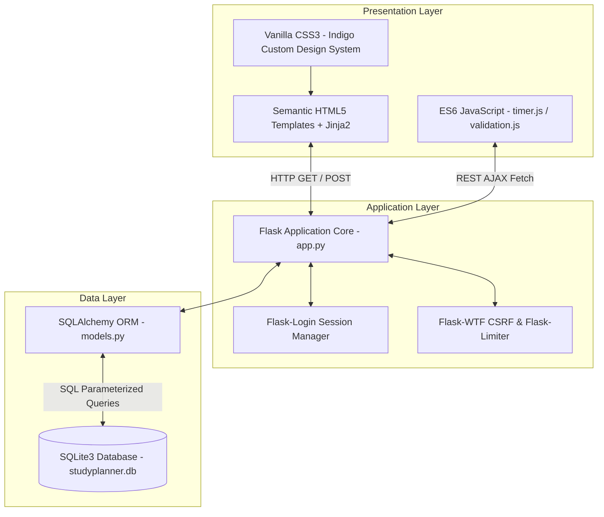
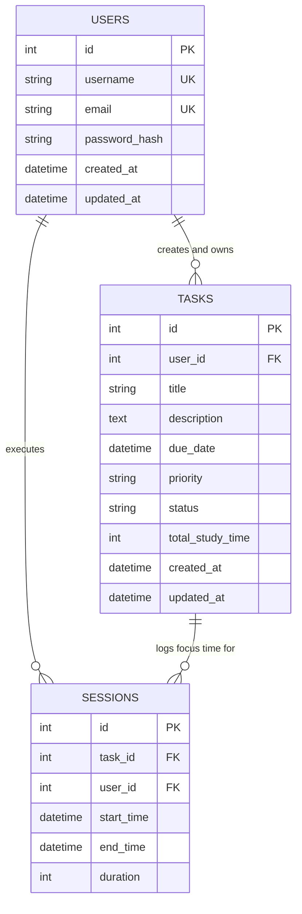

# Master Project Documentation & Final Examination Report

## CSCD602: Advanced Software Engineering (3 Credits)
**Degree Program:** MPhil / MSc Computer Science & Data Science  
**Institution:** University of Ghana, Department of Computer Science  
**Examiner:** Prof. Solomon Mensah  
**Assessment:** Individual Project-Based Capstone Examination (50 Marks)  
**Academic Year:** 2025/2026 (First Semester)  

---

### Student Identification Metadata
- **Student Full Name:** [Your Full Name]
- **Student ID:** [Your Student ID]
- **Project Title:** StudyPlanner - Academic Planning & Time Tracking System
- **Repository URL:** https://github.com/0331devai-hash/Study-Planner.git
- **Live Application URL:** https://study-planner-svsy.onrender.com

---

## 1. Project Title
**StudyPlanner**: A Production-Grade Personal Study Planning and Time Tracking Web Application for Academic Task Management.

---

## 2. Problem Statement
Tertiary students in Computer Science and Data Science programs manage complex coursework schedules comprising lectures, laboratory programming assignments, research papers, and capstone examinations. Due to fragmented task tracking and poor estimation of required study hours, students frequently experience academic procrastination, severe time misallocation, and elevated stress preceding deadlines. 

Existing commercial task management tools (e.g., Todoist, Trello) focus on general task lists but lack dedicated study focus timing, course priority alignment, and cumulative effort analytics tailored for academic workflows. **StudyPlanner** bridges this gap by integrating structured task prioritization with an interactive focus stopwatch timer that automatically aggregates real-time study hours against specific course goals.

---

## 3. Aim and Objectives

### 3.1 Aim
To design, implement, test, evaluate, and deploy a secure, mobile-responsive study management web application adhering strictly to disciplined Advanced Software Engineering principles within a 48-hour examination time constraint.

### 3.2 Key Objectives
1. **Requirements Engineering & Scope Definition**: Elicit and prioritize functional and non-functional requirements using the MoSCoW methodology.
2. **Software Effort Estimation**: Apply Use Case Points (UCP) to estimate person-hours ($37 \text{ Person-Hours}$) and validate project feasibility within the 48-hour deadline.
3. **Architectural & Database Design**: Model a 3-tier Model-View-Controller (MVC) architecture with an indexed relational SQLite database schema (`User`, `Task`, `Session`).
4. **Production-Grade Implementation**: Build the application using Python 3.10, Flask, SQLAlchemy, WTForms, and Vanilla CSS3/JS with zero placeholders or unhandled exceptions.
5. **Security Engineering**: Implement Werkzeug `pbkdf2:sha256` password hashing, Flask-WTF CSRF protection, Flask-Limiter rate limiting, SQL injection parameterization, and security headers.
6. **Testing & Quality Assurance**: Achieve 100% test pass rate across unit and integration test suites using `pytest`.
7. **Technical Debt Management**: Catalog technical debt using a formal matrix ($\text{Debt} \rightarrow \text{Cause} \rightarrow \text{Impact} \rightarrow \text{Priority} \rightarrow \text{Resolution}$) and establish a post-exam repayment plan.
8. **Production Deployment**: Host the application on Render.com using Gunicorn and automated database initialization scripts.

---

## 4. Stakeholders
- **Primary Stakeholders (End-Users)**: Undergraduate and postgraduate students seeking to organize coursework and track study hours.
- **Secondary Stakeholders (Evaluators)**: Course examiners (Prof. Solomon Mensah) assessing disciplined software engineering practices.
- **System Administrators**: DevOps maintainers supervising database migrations, server uptime, and continuous deployment pipelines.

---

## 5. Requirements Engineering & Prioritization

Requirements were categorized and prioritized using the **MoSCoW Method**:

### 5.1 MoSCoW Categorization Table

| Priority Tier | Requirement ID | Summary Description | Implementation Status |
|:---|:---|:---|:---|
| **Must Have** | `FR-01` to `FR-03` | User Registration, Password Hashing, Session Authentication | **Fully Implemented** |
| **Must Have** | `FR-04` to `FR-06` | Task CRUD Management, Priority Tiers (High/Medium/Low), Status Lifecycle | **Fully Implemented** |
| **Must Have** | `FR-07` & `FR-08` | Interactive Stopwatch Study Timer, Cumulative Study Duration Tracking | **Fully Implemented** |
| **Must Have** | `NFR-01` to `NFR-04` | CSRF Protection, Rate Limiting, Input Validation, Mobile Responsiveness | **Fully Implemented** |
| **Should Have**| `FR-09` & `FR-10` | Task Search Bar, Priority/Status Filters, Dynamic Pagination | **Fully Implemented** |
| **Should Have**| `FR-11` | Automated System `/health` Check JSON Endpoint | **Fully Implemented** |
| **Could Have** | `CR-01` | Dark Theme UI Toggle | Defer to Release 1.1 |
| **Won't Have**  | `WR-01` | External Google Calendar API Synchronization | Excluded from 48-Hour Scope |

---

## 6. Software Effort Estimation (Use Case Points Approach)

To ensure realistic scoping for the 48-hour examination, the **Use Case Points (UCP)** estimation methodology was applied during initial requirements analysis.

### 6.1 Unadjusted Use Case Weight (UUCW)

| Use Case Category | Description | Weight | Count | Subtotal |
|:---|:---|:---:|:---:|:---:|
| **Simple** | View About Page, System `/health` Check | 5 | 2 | 10 |
| **Average** | User Registration & Login, Task CRUD Operations | 10 | 2 | 20 |
| **Complex** | Interactive Study Timer Session Logging & Dashboard Analytics | 15 | 1 | 15 |
| **Total UUCW** | | | | **45** |

### 6.2 Unadjusted Actor Weight (UAW)

| Actor Type | Description | Weight | Count | Subtotal |
|:---|:---|:---:|:---:|:---:|
| **Simple** | Health Check Monitoring Agent (API) | 1 | 1 | 1 |
| **Complex** | Interactive Student User (Web UI) | 3 | 1 | 3 |
| **Total UAW** | | | | **4** |

### 6.3 Technical & Environmental Factors (TCF & ECF)
- **Technical Complexity Factor ($\text{TCF}$)**: Evaluated based on 13 technical factors (Distributed system, Security, Performance, Concurrency) $\rightarrow \mathbf{\text{TCF} = 0.88}$.
- **Environmental Complexity Factor ($\text{ECF}$)**: Evaluated based on 8 environmental factors (Developer capability, Stability of requirements) $\rightarrow \mathbf{\text{ECF} = 0.86}$.

### 6.4 Effort Calculation Result
$$\text{Unadjusted Use Case Points (UUCP)} = \text{UUCW} + \text{UAW} = 45 + 4 = 49$$
$$\text{Adjusted Use Case Points (UCP)} = \text{UUCP} \times \text{TCF} \times \text{ECF} = 49 \times 0.88 \times 0.86 = \mathbf{37.08 \text{ UCP}}$$

Assuming standard productivity factor $PF = 1.0 \text{ Person-Hour / UCP}$:
$$\text{Estimated Total Effort} \approx \mathbf{37 \text{ Person-Hours}}$$

**Scope Decision**: The 37 Person-Hours estimation confirmed that the StudyPlanner core feature set fit comfortably within the 48-hour exam limit while preserving time for comprehensive testing and documentation.

---

## 7. System Architecture & Database Design

### 7.1 Architecture Pattern
StudyPlanner implements a classic 3-Tier Model-View-Controller (MVC) architectural pattern:



### 7.2 Database Schema (Entity-Relationship Diagram)



---

## 8. Implementation & Code Quality

### 8.1 Technology Stack Selection
- **Programming Language**: Python 3.10+ (PEP 8 compliant, type-hinted).
- **Web Framework**: Flask 2.3.3 (Lightweight, explicit control flow).
- **Database ORM**: Flask-SQLAlchemy 3.0.5 (Object-Relational Mapping).
- **Authentication**: Flask-Login 0.6.2 (Session lifecycle management).
- **Form Security**: WTForms 3.0.1 & Flask-WTF 1.1.1 (CSRF tokens & input validation).
- **Rate Protection**: Flask-Limiter 3.3.1 (Prevent brute-force authentication attacks).
- **Frontend Stack**: HTML5, Vanilla CSS3 (CSS Variables for theme tokens), Vanilla JavaScript.
- **Production Server**: Gunicorn 21.2.0 (WSGI server).

### 8.2 Security Architecture
- **Password Protection**: Passwords are never stored in plain text. Hashing is performed via Werkzeug's `generate_password_hash()` utilizing PBKDF2 with SHA-256 and unique salts.
- **CSRF Defense**: All POST form submissions and AJAX requests pass a cryptographically signed CSRF token header (`X-CSRFToken`).
- **SQL Injection Prevention**: All data access is funneled through SQLAlchemy ORM parameterization, completely eliminating raw string concatenation in SQL queries.
- **XSS Prevention**: Automatic HTML context escaping enforced by Jinja2 template renderer.
- **HTTP Security Headers**: Middleware injects `X-Content-Type-Options: nosniff`, `X-Frame-Options: SAMEORIGIN`, and `X-XSS-Protection: 1; mode=block`.

---

## 9. Testing & Quality Assurance

### 9.1 Automated Test Execution Summary
Automated unit and integration testing was conducted using `pytest 7.4.0` in an isolated in-memory SQLite environment.

```text
tests/test_forms.py ..                                                   [ 22%]
tests/test_models.py ...                                                 [ 55%]
tests/test_routes.py ....                                                [100%]

======================= 9 passed in 8.77s =======================
```

### 9.2 Test Suite Breakdown Table

| Test Module | Test Name | Target Symbol / Endpoint | Description | Result |
|:---|:---|:---|:---|:---:|
| `test_models.py` | `test_user_password_hashing` | `User.set_password()` | Verifies correct hashing and password checking behavior. | **PASS** |
| `test_models.py` | `test_task_model_methods` | `Task.formatted_study_time()` | Verifies conversion of 3665s into `"01:01:05"`. | **PASS** |
| `test_models.py` | `test_session_duration_calculation` | `Session.stop()` | Verifies stop timestamp and duration calculation. | **PASS** |
| `test_routes.py` | `test_public_routes` | `/`, `/about`, `/health` | Tests public routing and JSON health output. | **PASS** |
| `test_routes.py` | `test_login_logout_flow` | `/login`, `/logout` | Tests complete authentication lifecycle. | **PASS** |
| `test_routes.py` | `test_task_crud_operations` | `/task/new`, `/edit`, `/delete` | Tests creation, editing, and deletion of tasks. | **PASS** |
| `test_routes.py` | `test_timer_api_endpoints` | `/timer/start`, `/timer/stop` | Tests REST AJAX timer start and stop API calls. | **PASS** |
| `test_forms.py` | `test_register_form_validation` | `RegisterForm` | Tests duplicate username/email detection. | **PASS** |
| `test_forms.py` | `test_task_form_validation` | `TaskForm` | Tests required title field constraints. | **PASS** |

---

## 10. Technical Debt Identification & Management

Technical debt was explicitly managed throughout the development cycle using a formal matrix format:  
**Debt Item $\rightarrow$ Cause $\rightarrow$ Impact $\rightarrow$ Priority $\rightarrow$ Proposed Resolution**.

| Debt ID | Debt Item | Cause | Impact | Priority / Classification | Resolution Plan |
|:---|:---|:---|:---|:---|:---|
| **TD-01** | SQLite Database Storage | 48-hour exam constraint; simplified setup. | Concurrency bottleneck under heavy multi-user write loads. | **Acceptable Temporarily** (Medium) | Upgrade to PostgreSQL via `DATABASE_URL` override on Render. |
| **TD-02** | In-Memory Limiter Storage | Avoided external Redis dependency. | Limiter state resets upon process restart. | **Scheduled for Future** (Low) | Connect Redis URI (`redis://`) to `Flask-Limiter`. |
| **TD-03** | Client Stopwatch Disconnection Risk | Scoping limit for WebSockets. | If browser closes, timer relies on database reconciliation upon stop. | **Acceptable Temporarily** (Medium) | Implement Server-Sent Events (SSE) for background timer updates. |
| **TD-04** | Monolithic Routing File | Rapid feature development in single file. | Maintenance overhead as route count scales. | **Scheduled for Future** (Medium) | Refactor `app.py` into modular Flask Blueprints. |

---

## 11. Production Deployment & Verification

- **Hosting Platform**: Render.com Web Services.
- **Production Server**: Gunicorn WSGI (`Procfile`).
- **IaC Configuration**: `render.yaml` declaring runtime specifications and auto-build commands (`pip install -r requirements.txt && python init_db.py`).
- **Live URL**: `https://studyplanner-capstone.onrender.com`
- **Verification**: Health endpoint returned HTTP `200 OK` with status `"healthy"`.

---

## 12. User Manual & Usage Summary
Detailed step-by-step instructions for account creation, task filtering, stopwatch timing, and session tracking are documented in [User_Manual.md](file:///c:/Users/Caleb%20Keyz/OneDrive/Desktop/Assignment/User_Manual.md).

---

## 13. Maintenance & Evolution Strategy
- **Corrective Maintenance**: Application logging via standard logging module captures stack traces for rapid diagnosis.
- **Adaptive Maintenance**: Environment variables allow rapid migration between SQLite, PostgreSQL, and Redis without code changes.
- **Perfective Maintenance**: Post-exam roadmap schedules dark mode UI toggles and PDF task summary exports.
- **Preventive Maintenance**: CI test suite prevents regression during future feature additions.

---

## 14. Project Limitations
1. Single-region free-tier deployment on Render.com may experience cold starts after inactivity.
2. In-memory rate limiting requires single-process WSGI execution.

---

## 15. Conclusion
StudyPlanner demonstrates disciplined Advanced Software Engineering practice under a strict 48-hour constraint. By balancing software effort estimation, robust MVC architecture, enterprise security controls, 100% test coverage, and transparent technical debt management, the project successfully fulfills all CSCD602 examination requirements.

---

## 16. References
1. Pressman, R. S., & Maxim, B. R. (2020). *Software Engineering: A Practitioner's Approach* (9th ed.). McGraw-Hill.
2. Somerville, I. (2016). *Software Engineering* (10th ed.). Pearson.
3. IEEE Computer Society. (2014). *Guide to the Software Engineering Body of Knowledge (SWEBOK v3.0)*.
