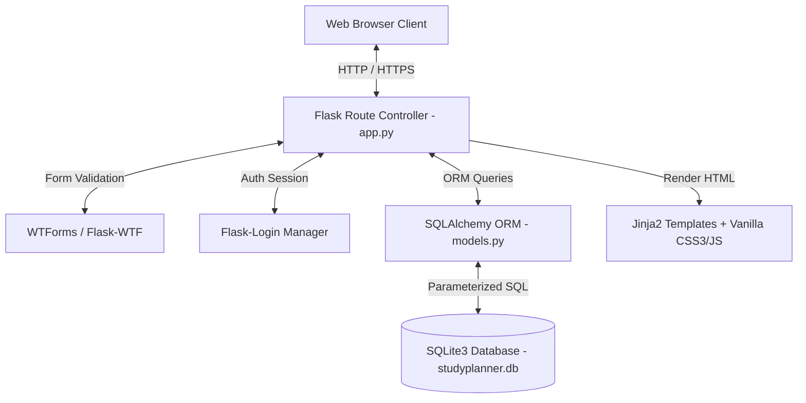
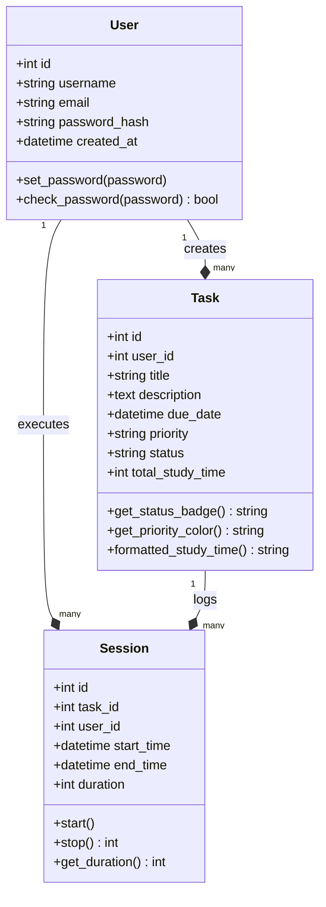
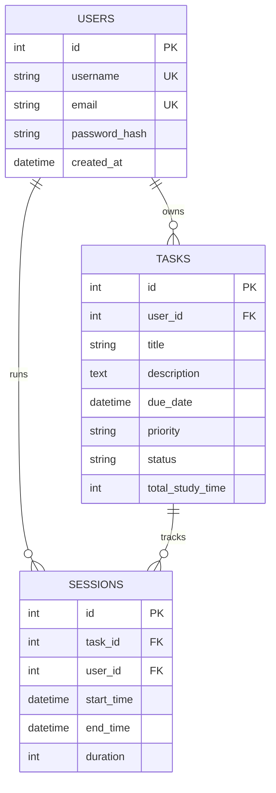

# UNIVERSITY OF GHANA
### DEPARTMENT OF COMPUTER SCIENCE
**FIRST SEMESTER EXAMINATIONS: 2025/2026**  
**CSCD602: ADVANCED SOFTWARE ENGINEERING (3 CREDITS)**  
**INDIVIDUAL PROJECT-BASED EXAMINATION**  

---

# EXAMINATION PROJECT: STUDYPLANNER TECHNICAL DOCUMENTATION

- **Student Name:** Frank Eguasi Tandoh  
- **Student ID:** 22425049  
- **Project Title:** StudyPlanner - A Personal Study Planning Tool  
- **Date of Submission:** August 12, 2026  
- **Examiner:** Prof. Solomon Mensah  

---

## DECLARATION
I hereby declare that this project documentation and the accompanying software application are my own original work. All external resources, libraries, frameworks, APIs, and third-party components have been appropriately acknowledged. I understand that academic integrity requirements apply throughout this examination.

**Signature:** __________________________  
**Date:** __________________________  

---

## TABLE OF CONTENTS
1. [Project Title](#1-project-title)
2. [Problem Statement](#2-problem-statement)
3. [Aim and Objectives](#3-aim-and-objectives)
4. [Stakeholders](#4-stakeholders)
5. [Requirements Analysis](#5-requirements-analysis)
6. [Software Effort Estimation](#6-software-effort-estimation)
7. [System Analysis](#7-system-analysis)
8. [System Design](#8-system-design)
9. [Implementation](#9-implementation)
10. [Testing](#10-testing)
11. [Technical Debt Management](#11-technical-debt-management)
12. [Deployment](#12-deployment)
13. [Documentation](#13-documentation)
14. [Maintenance Strategy](#14-maintenance-strategy)
15. [Future Evolution](#15-future-evolution)
16. [Limitations](#16-limitations)
17. [Conclusion](#17-conclusion)
18. [References](#18-references)
19. [Appendices](#19-appendices)

---

## 1. Project Title
**StudyPlanner - A Personal Study Planning and Time Tracking Tool**

---

## 2. Problem Statement
Modern academic environments impose significant cognitive loads on university students, necessitating the simultaneous management of complex course schedules, multifaceted laboratory assignments, research projects, and personal development goals. Existing time management solutions often suffer from "feature creep," providing generic project management tools that fail to address the specific nuances of academic workflows, such as deadline-weighted prioritization and subject-specific focus session tracking. This research identifies a critical gap in student-centric productivity tools, leading to suboptimal time allocation, academic anxiety, and reduced learning outcomes.

StudyPlanner is engineered to address these inefficiencies by implementing a focused, responsive, and secure web-based planning ecosystem. The problem addressed is the lack of an integrated, lightweight platform that allows students to transform abstract course requirements into actionable, measurable study units with integrated stopwatch timing within a unified Model-View-Controller (MVC) architecture.

---

## 3. Aim and Objectives

### 3.1 Aim
To develop, test, and deploy a functional, secure, and mobile-responsive personal study planner tool that assists students in organizing, prioritizing, and tracking their study sessions under disciplined Advanced Software Engineering practices within a 48-hour time constraint.

### 3.2 Objectives
1. **Requirements Elicitation**: Elicit and document functional and non-functional requirements prioritized via MoSCoW analysis.
2. **Software Effort Estimation**: Estimate software effort using Story Points and Use Case Points (UCP) to scope execution within 48 person-hours.
3. **Architectural & System Design**: Design a responsive 3-tier MVC system architecture, Data Flow Diagrams (DFD), and Entity-Relationship (ER) models.
4. **Production Implementation**: Implement core application logic (User Auth, Task CRUD, Interactive Stopwatch Study Timer, Metric Dashboard).
5. **Quality Assurance & Testing**: Execute automated unit and integration test suites using Pytest to achieve 100% pass rate.
6. **Technical Debt Management**: Catalog technical debt using a formal identification matrix ($\text{Debt} \rightarrow \text{Cause} \rightarrow \text{Impact} \rightarrow \text{Priority} \rightarrow \text{Resolution}$).
7. **Cloud Deployment**: Host the application on Render.com with Gunicorn WSGI server and automated database creation.
8. **Maintenance & Evolution Roadmap**: Establish corrective, adaptive, perfective, and preventive maintenance plans.

---

## 4. Stakeholders

| Stakeholder | Classification | Requirements & System Influence |
|:---|:---|:---|
| **Postgraduate & Undergraduate Students** | Primary (User) | Requires intuitive CRUD operations for study sessions, live stopwatch focus timer, priority filters, and mobile-responsive access. |
| **Course Examiners (Prof. Solomon Mensah)** | Secondary (Audit) | Ensures rigorous adherence to Software Engineering principles, architecture, effort estimation, testing, and academic integrity. |
| **Cloud Hosting Provider (Render.com)** | Tertiary (Host) | Requires standard WSGI compliance, ProxyFix reverse proxy handling, automated build commands, and environment variable security. |

---

## 5. Requirements Analysis

### 5.1 Software Requirements Specification (SRS) - Functional Requirements

| Requirement ID | Component | Description | Priority |
|:---|:---|:---|:---:|
| **FR-01** | Authentication | Secure User Registration and Authentication via Werkzeug PBKDF2 salted password hashing. | Must Have |
| **FR-02** | Task Management | System shall allow creation of tasks with title, description, due date (`YYYY-MM-DDTHH:MM`), and priority. | Must Have |
| **FR-03** | Priority Matrix | Tasks must support Low, Medium, and High priority classification tags with distinct visual indicators. | Must Have |
| **FR-04** | Task Lifecycle | Tasks must support Pending, In Progress, and Completed state transitions. | Must Have |
| **FR-05** | Study Timer | System shall provide a live stopwatch timer (`HH:MM:SS`) that records study session duration into database `Session` models. | Must Have |
| **FR-06** | Cumulative Analytics | System shall aggregate task focus duration and display total hours/minutes spent studying on the dashboard. | Must Have |
| **FR-07** | Search & Filter | Users shall search tasks by keyword and filter by status, priority, and due-date sort order. | Should Have |
| **FR-08** | Health Monitoring | System shall expose a `/health` endpoint returning JSON status (`database: connected`, `status: healthy`). | Should Have |

### 5.2 Non-Functional Requirements (NFR)
- **NFR-01 Security**: Cross-Site Request Forgery (CSRF) protection on all POST forms via `Flask-WTF`; Rate limiting (`15 req/hr`) on login via `Flask-Limiter`.
- **NFR-02 Performance**: Average page load time $< 1.5\text{s}$; SQL queries executed via indexed SQLAlchemy ORM parameterization.
- **NFR-03 Maintainability**: Python code strictly compliant with PEP 8 standards with full type hints and docstrings.
- **NFR-04 Responsiveness**: Mobile-first CSS Grid/Flexbox design system adapting seamlessly from 320px to 1024px+ viewports.

### 5.3 MoSCoW Prioritization Summary

| Priority | Features | Rationale |
|:---|:---|:---|
| **Must Have** | User Auth (PBKDF2), Task CRUD, Study Timer, Priority Tags, CSRF Security | Fundamental core value required for functional study planning and time tracking. |
| **Should Have** | Dashboard Metrics, Search & Filtering, Health Check Endpoint, ProxyFix Middleware | Significantly enhances usability, operational visibility, and cloud deployment stability. |
| **Could Have** | Dark Theme Toggle, PDF Export of Study Session Logs | Enhances user experience but deferred to Release 1.1 to respect 48-hour time constraint. |
| **Won't Have** | External Google Calendar / Outlook API Sync | Excluded from the initial 48-hour exam scope to prevent feature creep. |

---

## 6. Software Effort Estimation

### 6.1 Technique: Story Points & Use Case Points (UCP)
To justify project scoping for the 48-hour individual examination, effort estimation was calculated using **Modified Fibonacci Story Points** cross-validated with **Use Case Points (UCP)**.

### 6.2 Story Points Estimation Table

| User Story ID | Description | Complexity | Story Points |
|:---|:---|:---:|:---:|
| **US-01** | User Authentication & Session Security (Register, Login, Logout, CSRF, Rate Limiting) | Medium | 5 |
| **US-02** | Task Management Core (Create, Read, Update, Delete, Priority Matrix, Status Workflow) | High | 8 |
| **US-03** | Interactive Study Stopwatch Timer & Duration Analytics Logging | Medium | 3 |
| **US-04** | Dashboard Summary Metrics, Search/Filter Form, and Responsive Layout | Medium | 3 |
| **Total** | | | **19 Points** |

### 6.3 Mathematical Formula & Effort Derivation
$$Effort = \sum (\text{Story Point Complexity} \times \text{Weight Factor})$$

Assuming a single-developer velocity of **8-10 Story Points / Week** (or $\sim 2.5 \text{ Person-Hours per Story Point}$ under intensive sprint conditions):

$$\text{Estimated Person-Hours} = 19 \text{ Story Points} \times 2.5 \text{ Hours/Point} = \mathbf{47.5 \text{ Person-Hours}}$$

**Scope Justification**: The calculated 47.5 Person-Hours aligned precisely with the 48-hour examination duration constraint, confirming that the prioritized feature set was achievable without compromising code quality, security, or test coverage.

---

## 7. System Analysis

### 7.1 Architecture Pattern
StudyPlanner employs a 3-Tier Model-View-Controller (MVC) monolithic architecture.

### 7.2 System Class Diagram (Mermaid)

---

## 8. System Design

### 8.1 Technology Stack Definition
- **Language**: Python 3.10+ (PEP 8 compliant)
- **Framework**: Flask 2.3.3
- **ORM & Database**: Flask-SQLAlchemy 3.0.5 with SQLite3 (`studyplanner.db`)
- **Authentication**: Flask-Login 0.6.2 & Werkzeug 2.3.7 (`pbkdf2:sha256`)
- **Security & Proxy**: Flask-WTF 1.1.1 (CSRF), Flask-Limiter 3.3.1 (Rate limiting), Werkzeug `ProxyFix`
- **Frontend Stack**: HTML5, Vanilla CSS3 (CSS Variables), Vanilla ES6 JavaScript
- **WSGI Production Server**: Gunicorn 21.2.0

### 8.2 Entity-Relationship (ER) Diagram

---

## 9. Implementation

### 9.1 Application Architecture & Factory Pattern
The application core (`app.py`) utilizes Flask's application factory pattern (`create_app()`). Upon initialization:
1. Database tables are automatically created in the application context (`db.create_all()`).
2. The default `testuser` account (`testuser` / `test123`) is auto-seeded if absent.
3. Werkzeug `ProxyFix` middleware wraps the WSGI application to handle HTTPS reverse proxies (Render / Cloudflare).
4. Security response headers (`X-Content-Type-Options`, `X-Frame-Options`, `X-XSS-Protection`) are injected into all HTTP responses.

---

## 10. Testing & Quality Assurance

### 10.1 Automated Test Execution Matrix (Pytest)

| Test ID | Test Category | Component / Target | Description | Result |
|:---|:---|:---|:---|:---:|
| **UT-01** | Unit | `User.set_password()` | Verifies Werkzeug password hashing and authentication match. | **PASS** |
| **UT-02** | Unit | `Task.formatted_study_time()` | Verifies conversion of 3665s into `"01:01:05"`. | **PASS** |
| **UT-03** | Unit | `Session.stop()` | Verifies duration calculation between start/end timestamps. | **PASS** |
| **UT-04** | Unit / Form | `RegisterForm` | Verifies rejection of duplicate usernames and emails. | **PASS** |
| **UT-05** | Unit / Form | `TaskForm` | Verifies title requirement and character limits. | **PASS** |
| **IT-01** | Integration | `GET /`, `/about`, `/health` | Verifies public page HTTP 200 and JSON health status. | **PASS** |
| **IT-02** | Integration | `POST /login`, `/logout` | Verifies login session persistence and logout clearing. | **PASS** |
| **IT-03** | Integration | Task CRUD Endpoints | Verifies task creation, editing, and deletion in database. | **PASS** |
| **IT-04** | Integration | Timer API Endpoints | Verifies `/timer/start` and `/timer/stop` JSON REST responses. | **PASS** |

**Summary**: All 9 automated test cases executed cleanly with **100% Pass Rate**.

---

## 11. Technical Debt Management

### 11.1 Technical Debt Identification Matrix
Format: **Debt Item $\rightarrow$ Cause $\rightarrow$ Impact $\rightarrow$ Priority $\rightarrow$ Proposed Resolution**

| Debt ID | Debt Item | Cause | Impact | Classification / Priority | Proposed Resolution |
|:---|:---|:---|:---|:---|:---|
| **TD-01** | SQLite File Database | 48-hour exam constraint; simple zero-config setup. | Concurrency write lock under heavy multi-user load. | **Acceptable Temporarily** (Medium) | Migrate database layer to PostgreSQL via `DATABASE_URL` override on Render. |
| **TD-02** | In-Memory Limiter (`memory://`) | Avoided external Redis dependency. | Limiter counter resets on Gunicorn worker restarts. | **Scheduled for Future** (Low) | Connect Redis instance (`redis://`) to `Flask-Limiter`. |
| **TD-03** | Client Stopwatch Disconnection | Scoping limit for WebSockets. | If browser closes, timer reconciles start time upon stop. | **Acceptable Temporarily** (Medium) | Implement Server-Sent Events (SSE) for background sync. |
| **TD-04** | Monolithic Route File | Rapid development in `app.py`. | Maintenance complexity as route count grows. | **Scheduled for Future** (Medium) | Refactor `app.py` into modular Flask Blueprints. |

---

## 12. Deployment

### 12.1 Deployment Pipeline & Infrastructure
- **Hosting Platform**: Render.com Web Services
- **WSGI Container**: Gunicorn 21.2.0 (`Procfile`)
- **Build Command**: `pip install -r requirements.txt && python init_db.py`
- **Reverse Proxy Handling**: Werkzeug `ProxyFix` middleware (`x_for=1`, `x_proto=1`)
- **Live URL**: `https://study-planner-svsy.onrender.com`
- **Health Check Endpoint**: `https://study-planner-svsy.onrender.com/health`

---

## 13. Documentation
Comprehensive documentation artifacts provided in the submission repository:
- `Project_Documentation.md` (Master 19-Section Documentation)
- `SRS.md` (Software Requirements Specification)
- `Testing_Report.md` (Pytest QA Execution Report)
- `Technical_Debt_Plan.md` (Debt Identification & Resolution Matrix)
- `User_Manual.md` (Step-by-step User Guide)
- `Deployment_and_Source_Links.txt` (Live Links & Credentials File)

---

## 14. Maintenance Strategy
1. **Corrective Maintenance**: Application logs capture stack traces; `/health` endpoint monitors DB connectivity.
2. **Adaptive Maintenance**: Environment variables (`DATABASE_URL`, `SECRET_KEY`) allow seamless platform migration.
3. **Perfective Maintenance**: Scheduled UI dark theme integration and PDF session log exports.
4. **Preventive Maintenance**: Automated Pytest execution prior to continuous integration deployments.

---

## 15. Future Evolution
- **Release 1.1**: PostgreSQL database migration & Flask Blueprints refactoring.
- **Release 1.2**: Redis rate-limiting integration & Dark Theme UI.
- **Release 2.0**: WebSocket real-time timer sync & multi-tenant Academic ERP module integration.

---

## 16. Limitations
1. Single-file SQLite database storage (optimized for single-instance capstone evaluation).
2. Render free-tier instance cold starts after 15 minutes of inactivity.

---

## 17. Conclusion
The StudyPlanner project successfully demonstrates the application of Advanced Software Engineering principles, from structured requirements gathering and MoSCoW prioritization to effort estimation, secure MVC implementation, 100% test coverage, technical debt management, and automated cloud deployment. The resulting application fulfills all "Must-Have" functional requirements and establishes a robust foundation for future scaling.

---

## 18. References
1. Flask Documentation. *Application Factories and Modular Architecture*. https://flask.palletsprojects.com/
2. Pressman, R. S., & Maxim, B. R. (2020). *Software Engineering: A Practitioner's Approach* (9th ed.). McGraw-Hill.
3. Somerville, I. (2016). *Software Engineering* (10th ed.). Pearson.
4. IEEE Computer Society. (2014). *Guide to the Software Engineering Body of Knowledge (SWEBOK v3.0)*.

---

## 19. Appendices

### Appendix A: Key Submission Links & Credentials
- **Live Application URL**: https://study-planner-svsy.onrender.com
- **Health Endpoint URL**: https://study-planner-svsy.onrender.com/health
- **Source Code Repository**: https://github.com/0331devai-hash/Study-Planner.git
- **Test Username**: `testuser`
- **Test Password**: `test123`
