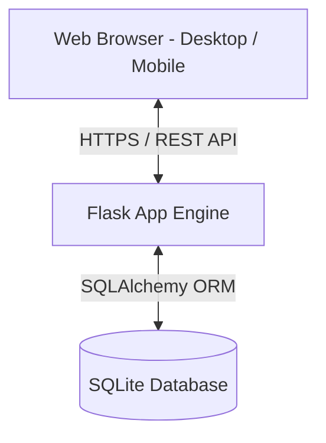

# Software Requirements Specification (SRS)

## Project Title: StudyPlanner - Academic Planning & Time Tracking System
**Course:** CSCD602: Advanced Software Engineering  
**Institution:** University of Ghana, Department of Computer Science  
**Author:** Frank Eguasi Tandoh (Student ID: 22425049)  

---

## 1. Introduction

### 1.1 Purpose
This Software Requirements Specification (SRS) document details the functional and non-functional requirements for **StudyPlanner**, a web-based study management and time-tracking application. Designed for undergraduate and graduate students, StudyPlanner addresses the challenge of academic procrastination and time misallocation by integrating task prioritization with an interactive focus stopwatch timer.

### 1.2 Scope
StudyPlanner provides:
- Secure multi-tenant user authentication with session management.
- Task management with priority tagging (High, Medium, Low) and lifecycle tracking (Pending, In Progress, Completed).
- Real-time study session logging with an integrated stopwatch timer.
- Analytical dashboard widgets aggregating study hours and upcoming deadlines.
- RESTful health check and filterable task listing.

### 1.3 Definitions, Acronyms, and Abbreviations
- **SRS**: Software Requirements Specification
- **CSRF**: Cross-Site Request Forgery
- **ORM**: Object-Relational Mapping (SQLAlchemy)
- **UCP**: Use Case Points (Effort Estimation)
- **JWT / Session Cookie**: HTTP-only session identifier

---

## 2. Overall Description

### 2.1 Product Perspective
StudyPlanner operates as an independent, web-accessible client-server application built on Python Flask, SQLite/SQLAlchemy, and Vanilla JavaScript/CSS3. It requires no third-party desktop client installations and is optimized for web browsers across desktop, tablet, and mobile viewports.

### 2.2 User Classes and Characteristics
- **Student User**: General user who registers, creates study tasks, logs time spent on coursework, and tracks completion metrics.

### 2.3 Operating Environment
- **Server**: Linux / Render.com container with Python 3.10+ and Gunicorn.
- **Database**: SQLite3 file-backed database (`studyplanner.db`).
- **Client**: Any modern web browser supporting HTML5, CSS flexbox/grid, and ES6 JavaScript (Chrome, Firefox, Safari, Edge).

---

## 3. Functional Requirements

### FR-01: User Account Registration
- **Description**: The system shall allow new users to create an account with a unique username, valid email, and secure password.
- **Inputs**: Username, Email, Password, Confirm Password.
- **Validation**: Username (3-64 chars, alphanumeric/underscores), Email format check, Password (min 8 chars, 1 letter, 1 digit).

### FR-02: User Authentication & Session Management
- **Description**: Users shall log in securely using their credentials. The system shall maintain authenticated sessions using HTTP-only cookies via Flask-Login.
- **Outputs**: Session token, dashboard redirect.

### FR-03: Task Creation & Categorization
- **Description**: Authenticated users shall create study tasks with titles, descriptions, due dates, priorities (Low, Medium, High), and initial status (Pending).

### FR-04: Task Filtering, Searching, & Sorting
- **Description**: Users shall search tasks by keyword, filter by priority or status, and sort by due date, priority order, or creation time.

### FR-05: Task Lifecycle Updates & Deletion
- **Description**: Users shall update task attributes (status, title, due date) or delete unwanted tasks with confirmation prompts.

### FR-06: Interactive Study Timer
- **Description**: The system shall provide an interactive stopwatch timer (`HH:MM:SS`) on task pages. Starting a timer creates a study `Session`, and stopping it calculates elapsed duration in seconds and aggregates it into the task's `total_study_time`.

### FR-07: Metrics Dashboard
- **Description**: The dashboard shall display dynamic metrics: Total Tasks, Pending Count, In Progress Count, Completed Count, Total Hours Studied, and Priority Deadlines.

### FR-08: Health Monitoring Endpoint
- **Description**: The system shall expose a `/health` endpoint returning JSON status (`200 OK` when healthy, database connectivity status, and timestamp).

---

## 4. Non-Functional Requirements

### NFR-01: Security Controls
- **Password Protection**: Passwords must be hashed using Werkzeug `pbkdf2:sha256` hashing with random salt.
- **CSRF Protection**: All state-modifying requests (`POST`) must validate a CSRF token (`Flask-WTF`).
- **Rate Limiting**: Authentication endpoints must enforce rate limits (`Flask-Limiter`: 10-15 requests/hour) to prevent brute-force attacks.
- **Headers**: Responses must include `X-Content-Type-Options`, `X-Frame-Options`, and `X-XSS-Protection`.

### NFR-02: Performance & Latency
- Page response time shall be under 500ms under standard loads.
- SQLite database transactions must execute concurrently without locking during read operations.

### NFR-03: Reliability & Availability
- Application uptime target shall be 99.5% on Render.com free tier.
- Database rollbacks must automatically trigger upon write transaction failure.

### NFR-04: Usability & Mobile Responsiveness
- Interface must render fluidly across mobile (320px+), tablet (768px+), and desktop (1024px+) screens using custom CSS Grid and Flexbox layout rules.
