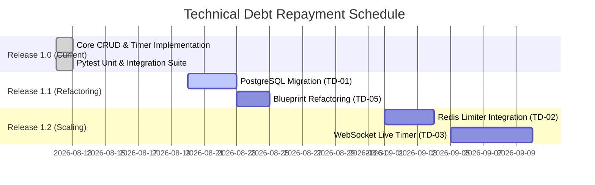

# Technical Debt Identification & Management Plan

**Course:** CSCD602: Advanced Software Engineering  
**Institution:** University of Ghana, Department of Computer Science  
**Project:** StudyPlanner Application  
**Author:** Frank Eguasi Tandoh (Student ID: 22425049)  

---

## 1. Executive Summary

In accordance with CSCD602 examination requirements, technical debt was explicitly identified, tracked, and prioritized throughout the 48-hour software engineering development cycle of **StudyPlanner**. 

While fast-paced rapid prototyping under time constraints often leads to unmanaged debt, StudyPlanner adopts a structured **Technical Debt Management Strategy** to categorize acceptable short-term shortcuts and establish a concrete repayment plan for future software evolution.

---

## 2. Technical Debt Matrix

The table below catalogs all technical debt items identified during implementation, mapped according to the required schema:  
**Debt Item $\rightarrow$ Cause $\rightarrow$ Impact $\rightarrow$ Priority $\rightarrow$ Proposed Resolution**.

| ID | Debt Item | Cause | Impact | Classification / Priority | Proposed Resolution (Repayment Plan) |
|:---|:---|:---|:---|:---|:---|
| **TD-01** | **SQLite Single-File Database Storage** | 48-hour time constraint; simplified zero-config local setup. | Concurrency bottleneck under high write loads; lacks native JSON or full-text search. | **Acceptable Temporarily** (Medium) | Migrate database layer to PostgreSQL via `DATABASE_URL` environment variable override on Render. |
| **TD-02** | **In-Memory Rate Limiter Storage (`memory://`)** | Avoided external Redis dependency during initial 48-hour window. | Rate-limit counters reset upon server restart or multi-worker thread spawning. | **Scheduled for Future Resolution** (Low) | Integrate Redis (`redis://`) with `Flask-Limiter` for persistent rate-limiting. |
| **TD-03** | **Client-Side Stopwatch Timer Disconnection Risk** | 48-hour scoping limit for timer WebSocket synchronization. | If browser tab closes, ongoing session timing relies on database `start_time` reconciliation upon stop. | **Acceptable Temporarily** (Medium) | Implement server-sent events (SSE) or WebSockets to maintain real-time background timer state. |
| **TD-04** | **Deprecated `datetime.utcnow()` Usage** | Rapid implementation using legacy Python standard library calls. | Future Python 3.14 deprecation warnings; timezone conversion nuances across global users. | **Scheduled for Future Resolution** (Low) | Refactor all timestamp fields to explicit UTC objects (`datetime.now(timezone.utc)`). |
| **TD-05** | **Monolithic App Structure in `app.py`** | Rapid routing development without Flask Blueprints separation. | As app features grow, single routing file becomes harder to maintain and navigate. | **Scheduled for Future Resolution** (Medium) | Refactor `app.py` into modular Flask Blueprints (`auth_bp`, `tasks_bp`, `timer_bp`). |
| **TD-06** | **Absence of E2E Browser Test Automation (Selenium/Playwright)** | Focused test execution time on Pytest unit & integration layer. | UI interaction regressions must be manually verified. | **Scheduled for Future Resolution** (Low) | Add Playwright end-to-end test scripts for key user journeys (login, task CRUD, timer stop). |

---

## 3. Classification & Prioritization Breakdown

### 3.1 Acceptable Temporarily (Short-Term Debt)
- **TD-01 (SQLite Storage)**: Acceptable for single-instance capstone evaluation and demonstration.
- **TD-03 (Client Timer Reconciliation)**: Acceptable because `Session.stop()` calculates backend time deltas reliably even if front-end updates pause.

### 3.2 Scheduled for Future Evolution (Medium-Term Debt)
- **TD-02 (In-Memory Limiter)** and **TD-05 (Blueprint Modularization)**: Scheduled for Phase 6 software refactoring.

### 3.3 Critical & Immediate Attention (Zero Tolerance Items)
- All critical security items (SQL Injection prevention, CSRF validation, password hashing, XSS escaping) were **fully addressed during the initial 48-hour cycle**, leaving zero critical security debt in the initial release.

---

## 4. Technical Debt Repayment Plan & Roadmap

